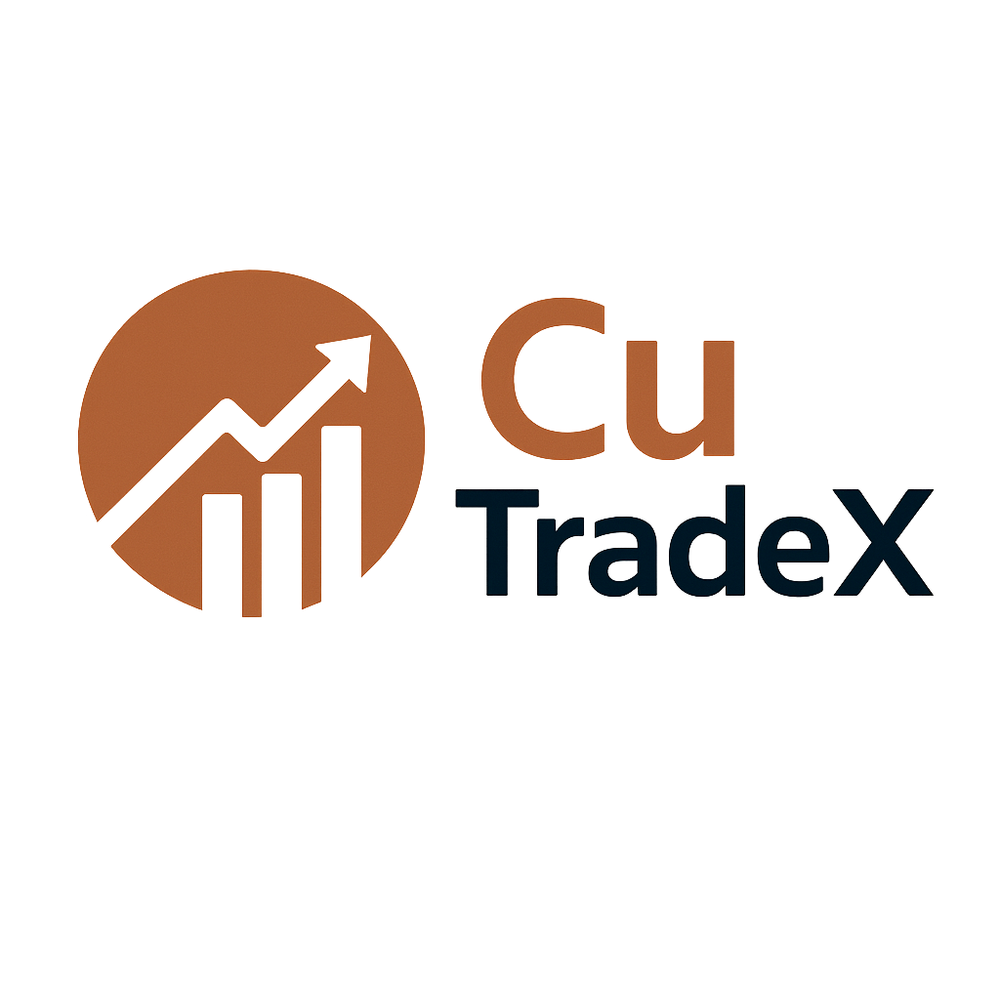

<p align="center">
  
</p>

# CuTradeX

**CuTradeX** is a proof-of-concept application for decision-making in **daily copper trading**. It combines **reinforcement learning** and advanced forecasting/classification/scoring models to assist in navigating the volatility of commodity markets, particularly copper.

---

## Core Concept

CuTradeX uses a **Proximal Policy Optimization (PPO) Actor-Critic** reinforcement learning model to make final trading decisions. The RL agent is informed by historical and technical copper data, as well as the outputs of three specialized deep learning models:

- **TimeGPT-1**: for time series **forecasting**
- **TCN (Temporal Convolutional Network)**: for **signal classification**
- **TFT (Temporal Fusion Transformer)**: for **scoring and prioritization**

This multi-model approach enables more robust and explainable decisions under high volatility.

---

## Installation
>numpy<br>pandas<br>plotly<br>torch

## Project Structure

```bash
.
├── df/                        # Data directory
│   ├── df_copper_rl.csv
│   ├── df_encoded.csv
│   ├── df_forecast_rl.csv
│   ├── df_label_rl.csv
│   └── df_score_rl.csv
├── .gitignore
├── README.md                 
├── ppo_model_incremental.pth # Trained PPO model weights
├── requirements.txt         # Project dependencies
└── trading_app.py           # Main application code

